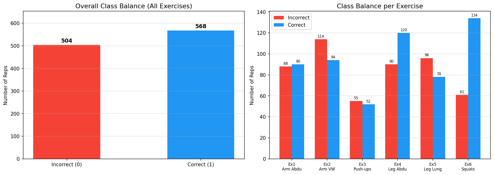
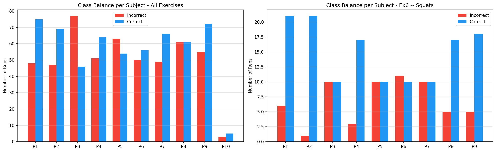
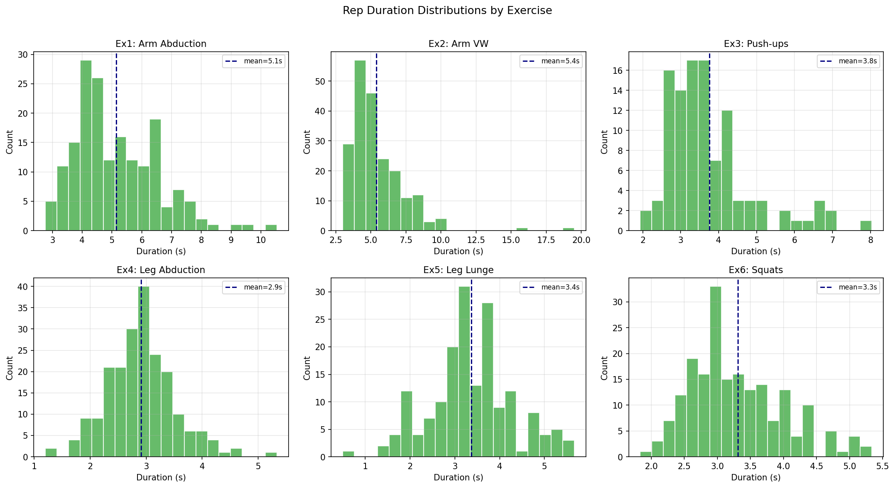
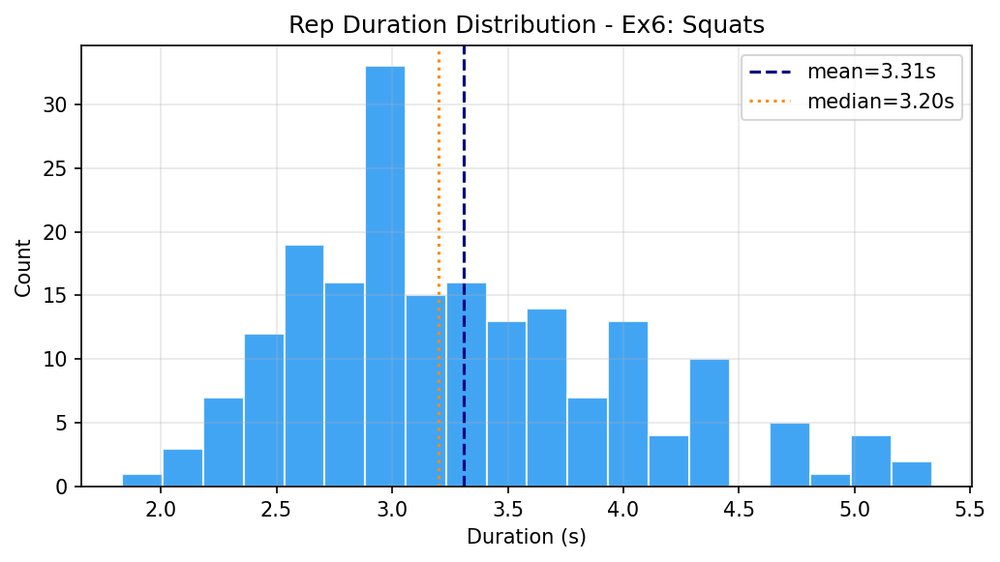
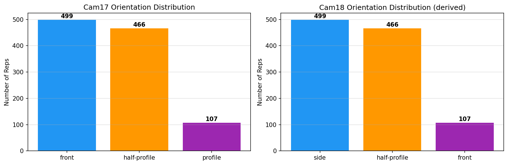
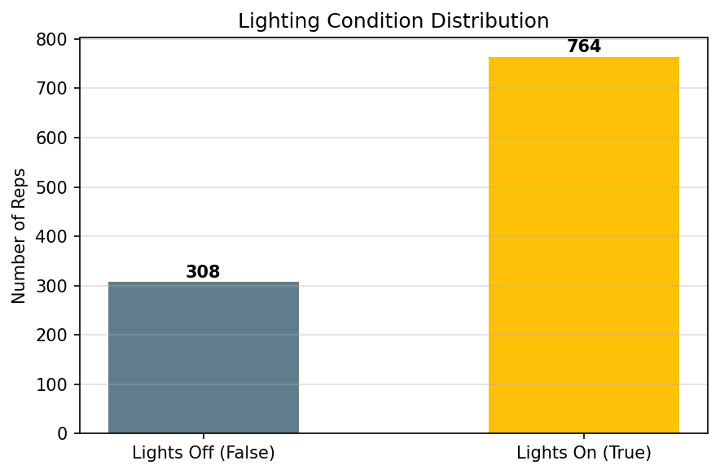
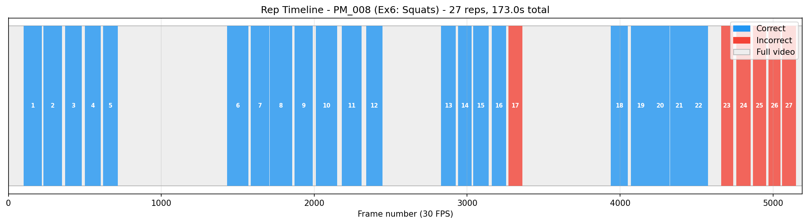
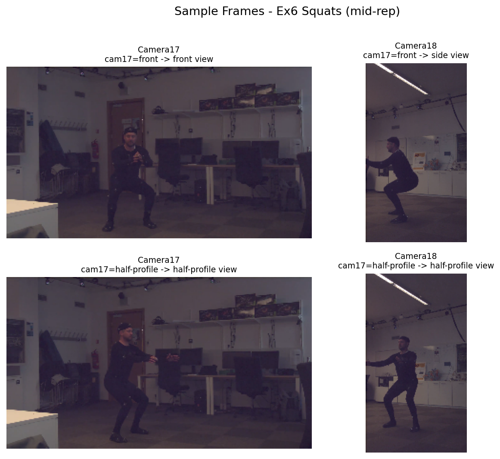

# REHAB24-6 Dataset Exploration Report
**SYDE 660A | Group Project Update**

---

## What We Are Working With

The REHAB24-6 dataset contains 1,072 annotated exercise repetitions performed by 10 subjects across six exercises: arm abduction, arm VW, push-ups, leg abduction, leg lunge, and squats. Our project focuses on squats (Exercise 6), but the exploration covers all six so we understand the full structure before narrowing down.

Each session was recorded simultaneously from two orthogonal cameras. Camera17 is mounted horizontally with a wide field of view, and Camera18 is mounted vertically in a narrower field of view, positioned 90 degrees away from Camera17. This matters a lot for pose estimation, which we will come back to in the next steps section.

Every repetition is annotated with a binary correctness label (1 = correct, 0 = incorrect). There are no per-fault labels, meaning the dataset tells us whether a rep was wrong but not specifically what went wrong. Generating that kind of interpretable breakdown is the core challenge of our pipeline.

---

## Figure 1: Overall Class Balance

Across all exercises and subjects combined, the dataset is roughly balanced: 568 correct reps versus 504 incorrect, sitting at about 53% / 47%. That is a healthy split for binary classification.

The right panel breaks this down per exercise. A few things stand out. Push-ups (Ex3) has by far the fewest repetitions at around 107 total, which will matter if we ever want to train on it. The arm VW exercise (Ex2) has the most incorrect reps at 114, suggesting subjects found it harder to execute consistently. Squats (Ex6) show a noticeable lean toward correct reps: 134 correct versus only 61 incorrect. That 69/31 split is something we need to plan around for the squat classifier specifically.

---

## Figure 2: Class Balance Per Subject

This is where the globally balanced picture starts to break down. The left panel shows all exercises and the right panel isolates squats.

For squats specifically, Person 2 stands out immediately: 21 correct reps and just 1 incorrect rep. That single incorrect rep is not enough to learn anything meaningful from when that subject is used as a test fold. Several other subjects also lean heavily toward correct performance (Persons 1, 4, 8, and 9 all have more than 3x the correct reps versus incorrect). Only Persons 3, 5, 6, and 7 have close to balanced squat data.

There is also a structural gap worth noting: Person 10 does not appear in the squat data at all, even though they participated in the other exercises. So our squat analysis has nine subjects, not ten.

This per-subject imbalance is the single most important thing to keep in mind when designing evaluation. A naive leave-one-subject-out split will produce a misleading result for Person 2, since their test fold contains almost no negative examples.

---

## Figure 3: Repetition Duration Distributions (All Exercises)

Each subplot shows how long a single rep takes, in seconds at 30 FPS, for each exercise. A few observations:

The arm exercises (Ex1 and Ex2) are the slowest, averaging around 5 seconds per rep, and they have the widest spread. Arm VW in particular has a long right tail reaching almost 20 seconds, which points to a handful of very slow or struggling reps. Push-ups and the leg exercises are faster and more tightly distributed, all averaging under 4 seconds. Squats come in at a mean of 3.3 seconds, with most reps clustering between 2.5 and 5 seconds.

The practical takeaway for model design is that we cannot use fixed-length time windows across exercises. Each exercise has its own natural rhythm. Even within a single exercise, the duration spread is wide enough that we will need to either resample sequences to a fixed length or use a model architecture that handles variable-length input.

---

## Figure 4: Squat Duration in Detail

Zooming in on squats, the distribution is fairly tight. The mean is 3.31 seconds and the median is 3.20 seconds, and the bulk of reps fall between 2 and 5 seconds. The slight rightward tail suggests a small number of slower reps, but there are no extreme outliers in this exercise.

For temporal modeling of squats, this means a 5-second analysis window captures essentially all reps without wasted padding. If we normalize reps to 100 time steps (each step representing about 33ms), we are working with a manageable and realistic resolution.

---

## Figure 5: Camera Orientation Distribution

The dataset uses three named orientations relative to Camera17: front (subject facing the camera), half-profile (diagonal), and profile (subject fully sideways to the camera). Because Camera18 is orthogonal to Camera17, these flip: when Camera17 sees the front, Camera18 sees the side.

Across all exercises, the front and half-profile orientations are well represented with roughly 500 reps each. The profile orientation appears much less, at only 107 reps. This means that for most of the dataset, Camera18 is seeing either a side view or a half-profile view.

For squats specifically, the profile orientation does not appear at all. Every squat rep was recorded with the subject either facing Camera17 directly or at a diagonal. This is a critical finding: for squats, the best sagittal (side) view always comes from Camera18 in the front-orientation sessions. In half-profile sessions, neither camera gives a clean side view.

---

## Figure 6: Lighting Conditions

764 reps were recorded with lights on, and 308 with lights off. The lights-off sessions are not completely dark (the space has ambient illumination from screens and equipment), but the reduction in brightness and contrast is enough to affect pose estimation reliability. About 29% of the dataset was captured in reduced light.

For our purposes, we will keep lights-off reps in training but flag them as a potential source of higher pose detection failures. If MediaPipe struggles on these frames, the quality filter we already built into the manifest (`quality_ok` column) combined with the `lights_on` flag gives us a clean way to stratify or exclude them.

---

## Figure 7: Annotated Rep Timeline for a Squat Session

This plot shows session PM_008, which has the largest number of squat repetitions: 27 reps spanning 173 seconds of video. Blue segments are correctly performed reps, red segments are incorrect, and the gray background is the full video including rest periods.

The structure is immediately readable. Reps are grouped into blocks separated by rest periods, which correspond to orientation changes during the session. The subject performed correct reps first (reps 1 through 16), then a single incorrect rep (17), then more correct reps (18 through 22), and finally a block of incorrect reps (23 through 27) near the end.

This timeline confirms something important for our design: rest gaps between reps are real and visible in the frame data. A future automatic segmentation module would need to identify these gaps to isolate individual reps. For now, the ground truth boundaries in our manifest handle this for us, so we can focus on what happens within each annotated rep window.

---

## Figure 8: Sample Frames from Both Cameras

These are mid-rep frames extracted from actual squat videos, showing all combinations of camera and orientation that appear in the dataset.

The top row is the front orientation. Camera17 (top left) gives a direct frontal view of the subject: you can see the face, chest, and arms clearly, but the depth of the squat is hidden behind the body. Camera18 (top right) in this same session gives the side view, and this is clearly the most useful angle for analyzing squat form. The knee travel, hip hinge, and torso lean are all visible.

The bottom row is the half-profile orientation. Here both cameras see the subject at roughly 45 degrees. Neither gives a clean sagittal view, but joint positions are still partially visible and MediaPipe should still be able to locate landmarks reasonably well.

The conclusion for our pipeline is straightforward: when a squat session has front orientation, we should prioritize Camera18 for pose extraction. When it has half-profile orientation, either camera gives us roughly equivalent information and we may want to use both.

---

## Data Quality Notes

Before getting into the next steps plan, a few quality flags from our manifest are worth knowing:

- **3 reps have frame annotations that exceed the actual video length** (PM_117a rep 9, PM_045 rep 8, and PM_103 rep 24). These are marked `frames_in_range = False` and should be excluded from any frame-level work.
- **283 of 1,072 reps (26.4%) fail our `quality_ok` filter**, mostly because a second person or their body part entered the camera frame at a noticeable level. The manifest `quality_ok` column filters these out in a single line at load time.
- **All 65 video IDs in the CSV resolve to files on disk**, so there are no missing videos.

---

## Next Steps: From Raw Video to Interpretable Feedback

This section lays out our proposed pipeline for turning the raw video data and rep boundaries into per-rep feedback. The work breaks into four stages.

---

### Stage 1: Pose Extraction

The first step is running MediaPipe Pose on the video frames for each annotated rep. MediaPipe outputs 33 body landmarks per frame, each with (x, y, z) coordinates normalized to the image frame and a visibility score between 0 and 1.

**Camera selection strategy.** Rather than running pose on all frames from all videos, we should be selective:

- For front-orientation squat sessions, extract from Camera18. This gives the sagittal view where knee and hip angles are clearly visible.
- For half-profile sessions, extract from both cameras and keep whichever has higher mean landmark visibility across the rep.
- The `sagittal_view_camera` column in `rep_manifest.parquet` already encodes this logic for every rep.

**What to extract per frame.** We care primarily about lower-body landmarks for squats. The relevant MediaPipe landmark indices are:

| Landmark | Index |
|----------|-------|
| Left/Right Hip | 23, 24 |
| Left/Right Knee | 25, 26 |
| Left/Right Ankle | 27, 28 |
| Left/Right Shoulder | 11, 12 |
| Left/Right Heel | 29, 30 |
| Left/Right Foot Index | 31, 32 |

Shoulders are included because forward lean during a squat shows up as the shoulders traveling past the toes, and that angle is a common fault indicator.

**Output format.** For each rep, store a 2D array of shape `(n_frames, n_landmarks * 3)` where the three values per landmark are x, y, and visibility. Save these as compressed numpy arrays or an HDF5 file keyed by `video_id + repetition_number`, linked back to the manifest via those columns.

**Quality gate.** After extraction, compute mean visibility per landmark per rep. If the mean visibility of both knees across a rep falls below a threshold (0.6 is a reasonable starting point), flag that rep as unreliable for angle-based features. Log these flags into an updated manifest column called `pose_ok`.

---

### Stage 2: Joint Angle Computation

Raw landmark coordinates need to be converted to biomechanically meaningful angles. For squats, the three most important angles are:

**Knee flexion angle.** Computed at each frame as the angle formed by the hip, knee, and ankle landmarks on the same side. At standing, this is approximately 180 degrees. At the bottom of a squat, a correct deep squat reaches around 90 degrees or below. Shallow squats that fail to reach sufficient depth will show a minimum angle above 110 degrees.

**Hip flexion angle.** The angle at the hip joint between the shoulder, hip, and knee. As the subject lowers into the squat, the hip flexes forward. Excessive forward lean (a common fault) shows up as a very acute hip angle at the bottom.

**Knee valgus (lateral deviation).** This is harder to measure from a single camera because it requires seeing both the front and side simultaneously. From the side view (Camera18 in front orientation), a proxy is the horizontal distance between the knee and ankle landmark. If the knee tracks significantly inward relative to the ankle at the bottom, that indicates valgus collapse.

**Compute these as time series.** For each rep, you get a trajectory of each angle from start frame to end frame. The shape is `(n_frames,)` per angle. These trajectories are the primary input to both the phase segmentation and the classifier.

---

### Stage 3: Phase Segmentation Within Each Rep

The ground truth rep boundaries (first_frame, last_frame) tell us where each rep starts and ends, but they do not tell us what happens within the rep. For interpretable feedback we need to know which part of the movement was wrong. Splitting each rep into phases is how we do that.

A squat naturally has three phases:

1. **Descent phase:** The subject begins to lower from standing. This starts at the first frame of the rep and ends at the bottom of the squat.
2. **Bottom phase:** A short window around maximum knee flexion. In practice this can be defined as all frames where the knee angle is within 5 degrees of its minimum value for that rep.
3. **Ascent phase:** The subject returns from the bottom back to standing. This runs from the end of the bottom phase to the last frame of the rep.

**How to find the bottom:** The bottom of the squat corresponds to the minimum knee flexion angle in the rep. Because the knee angle signal is not perfectly smooth, apply a light Savitzky-Golay smoothing filter before finding the minimum. The frame index of the minimum angle is the split point between descent and ascent.

**Phase-level features.** Once phases are identified, compute summary statistics per phase rather than using raw frame-by-frame values as input to the classifier. For example:

- Minimum knee angle reached during descent (depth check)
- Rate of change of knee angle during descent (controlled lowering speed)
- Consistency of knee trajectory during ascent (wobble or compensation)
- Maximum hip flexion angle at the bottom (forward lean check)
- Symmetry ratio: left knee angle versus right knee angle averaged across the rep

These per-phase, per-joint summaries are much easier to map back to human language than raw coordinate sequences, which is why this step matters for interpretability.

---

### Stage 4: Classification and Feedback Generation

With phase-level features in hand, the classification problem becomes reasonably tractable.

**Input to the classifier.** Each rep is represented as a fixed-length feature vector containing the phase summaries described above. Something in the range of 20 to 40 features per rep, all computed from pose landmarks. This is small enough to work well with interpretable models like gradient boosted trees or logistic regression, where feature importances have clear meaning.

**Why not a deep sequence model as the first step.** A transformer or LSTM trained on raw landmark sequences would likely achieve higher accuracy, but its predictions would be black-box. Since interpretable feedback is an explicit goal, we should start with an interpretable model and treat the feature engineering in Stages 2 and 3 as the main source of discriminative power. A deep model can be layered on later for comparison.

**Feedback generation.** After training, the classifier gives us a prediction (correct or incorrect), but we also want to say why. The approach is to look at which features were most predictive of the incorrect class and translate those back into language. A few concrete examples:

- If minimum knee angle at the bottom is the top discriminating feature, the feedback is: "The squat did not reach sufficient depth. Try lowering until your thighs are parallel to the floor."
- If hip angle at the bottom is discriminating, the feedback is: "There is excessive forward lean. Focus on keeping your torso more upright."
- If left/right knee symmetry is discriminating, the feedback is: "Your knees are tracking unevenly. Check that both knees stay in line with your toes."

**Handling Person 2 in evaluation.** Given that Person 2 has only 1 incorrect squat rep, their fold in a leave-one-subject-out evaluation will not give a reliable recall estimate. The practical options are to pool Person 2 with another low-count subject when they are selected as the test fold, or to report results separately for subjects with balanced data and flag Person 2 as an edge case.

---

## Summary of What Comes Next

| Stage | Task | Key Input | Key Output |
|-------|------|-----------|------------|
| 1 | Pose extraction | Video frames + rep boundaries | Per-frame landmark arrays with visibility scores |
| 2 | Angle computation | Landmark arrays | Per-frame angle time series (knee, hip, valgus proxy) |
| 3 | Phase segmentation | Angle time series | Phase boundaries + per-phase feature vectors |
| 4 | Classification + feedback | Feature vectors | Correct/incorrect label + human-readable explanation |

The manifests we have built already contain everything needed to drive Stage 1: video paths, camera selection via `sagittal_view_camera`, rep boundaries via `first_frame` and `last_frame`, and quality flags via `quality_ok` and `frames_in_range`. Stage 1 is the natural first coding task for the group to take on together.

The biggest open question before Stage 4 is whether the phase-level features we compute in Stage 3 are actually discriminative enough to separate correct from incorrect reps. The optional MediaPipe probe (`python -m src.explore --probe-pose`) will give us early landmark visibility numbers across orientations and camera views, which will tell us whether the signal is even there before we invest in the full pipeline.
